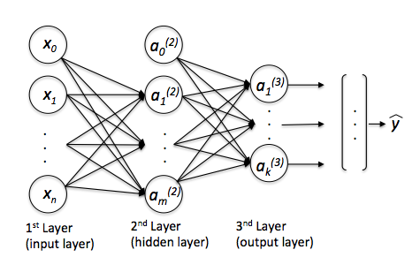

# Multi-Layer Perceptron (MLP)

This project implements and evaluates multilayer perceptrons (MLPs) from scratch using Python and NumPy. It includes code for training on toy datasets such as XOR, as well as comparison with a log-linear model.



## Setup

### Prerequisites
- Python 3.x
- NumPy

You can install the dependencies using:

```bash
pip install -r requirements.txt
```

## Running the code

### Training a Model

To train the MLP on provided data:

```bash
python train_mlp1.py
```

To compare with the log-linear model:

```bash
python train_loglin.py
```

### Testing on XOR

To test MLP learning on XOR:

```bash
python xor_data.py
python train_mlp1.py --data xor
```

### Running Gradient Check

Ensure your gradients are implemented correctly:

```bash
python grad_check.py
```

## Evaluation

Model predictions are saved in `test.pred`. You can evaluate using provided scripts or compare with ground truth labels in the `test` folder.

## Notes

- All models are implemented from scratch using NumPy, with no deep learning frameworks used.
